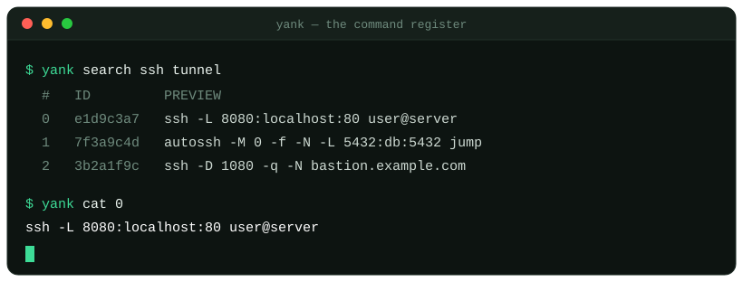

# yank-run-cli

<p align="center">
  
</p>

Command-line client for [yank.run](https://yank.run) — search, store, and
run code snippets without leaving your terminal.

```bash
yank search ssh tunnel                # find a snippet
yank show 0                           # eyeball the first result
yank cat 0 | bash                     # run it

# store a snippet — the body (-b) is all you need
yank push -b 'ssh -L 8080:localhost:80 user@server'

# title, description, tags and author are optional
yank push -b 'ssh -L 8080:localhost:80 user@server' \
  -t "Local port-forward" -d "remote :80 → local :8080" \
  --tag ssh,net --author '@me'
```

## Install

With Go:

```bash
go install github.com/korotinm/yank-run-cli/cmd/yank@latest
```

The binary is installed as `yank` into `$(go env GOPATH)/bin` — make sure
that directory is on your `PATH`.

From source:

```bash
git clone https://github.com/korotinm/yank-run-cli
cd yank-run-cli
make install            # → $(go env GOPATH)/bin/yank
# or just build locally:
make build              # → ./bin/yank
```

## Commands

| Command | Purpose |
|---|---|
| `yank push`   | create a snippet from `-b BODY`, `-f FILE`, or piped stdin |
| `yank cat`    | print a snippet body to stdout (pipe-friendly, no extra newline) |
| `yank show`   | colored, human-readable snippet view |
| `yank search` | full-text search; prints an indexed list of results |
| `yank copy`   | copy a snippet body to the system clipboard |
| `yank open`   | open the snippet in the default browser |

Run `yank <command> --help` for the full flag list of any command.

## Snippet references

Commands that operate on a single snippet (`cat`, `show`, `copy`, `open`)
accept a `REF` that is either:

- a **64-char hex id**, or
- a **0-based index** into the results of your last `yank search`.

`yank search` remembers its results, so `yank cat 0` refers to the first
hit, `yank show 2` to the third, and so on — until the next search.

## Output conventions

The CLI is built for shell pipelines:

- **stdout** carries data only (snippet body, search rows, ids).
- **stderr** carries everything else (hints, errors, progress).
- **Colors** appear only on an interactive terminal, and are disabled by
  `--no-color` or the `NO_COLOR` environment variable.
- `--json` is available on `push`, `show`, and `search` for scripting.

```bash
yank search kubectl | fzf | awk '{print $1}' | xargs yank cat
yank cat <id> > script.sh
```

## Configuration

| Variable | Default | Effect |
|---|---|---|
| `YANK_URL`     | `https://api.yank.run` | service base URL |
| `YANK_WEB_URL` | `https://yank.run` | website URL used by `yank open` |
| `NO_COLOR`     | unset | disable ANSI colors when set to any value |

CLI flags (`--url`, `--timeout`, `--json`, `--no-color`) always override
the environment.

## Exit codes

| Code | Meaning |
|---|---|
| 0 | success |
| 2 | usage / client-side validation error |
| 3 | not found, or invalid snippet reference |
| 4 | rate limited |
| 5 | server or network error (also clipboard failures) |

## License

[MIT](LICENSE) © Mikhail Korotin
